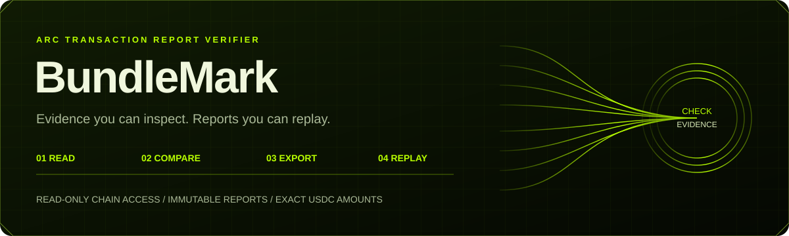

<div align="center">
  
  <h1>BundleMark</h1>
  <p><strong>Arc Transaction Report Verifier</strong></p>
  <p>Verify a transaction. Inspect the evidence. Export and replay the report.</p>
  <p>English · <a href="README.zh-CN.md">Simplified Chinese</a> · <a href="https://web--atl-web--xtd599t97njk.code.run/">Open verifier</a> · <a href="docs/arc-task-ledger/settlement-verifier/openapi.json">API reference</a></p>
  
  
  
</div>

<br />



<div align="center">
  <strong>READ THE CHAIN</strong> &nbsp; / &nbsp; <strong>CHECK THE CONDITIONS</strong> &nbsp; / &nbsp; <strong>KEEP THE EVIDENCE</strong>
  <p><a href="#quick-start">Quick start</a> · <a href="#documentation">Documentation</a> · <a href="#interpreting-a-result">Understanding results</a></p>
</div>

## A transaction report you can check independently

Transaction screenshots are difficult to verify independently. BundleMark reads an Arc mainnet transaction, identifies USDC movements, and compares them against receiving conditions supplied by the user. Versioned reports preserve raw receipts, evidence positions, coverage, source sets, acquisition times, and rule versions. Select an amount, graph edge, or check to inspect the underlying evidence.

1. Enter a new transaction hash or a registered explorer link and select **Read transaction**.
2. Select exact movements. Enter the expected payee, amount or range, optional movement payer, and UTC time conditions.
3. Inspect matched, mismatched, and unknown results with the explanation for each check. Without conditions, the result is an observation report.
4. Save and export an immutable report. Preview its full contents before explicitly publishing an irreversible public version.
5. Replay the bundle in a separate process or consume it for local reconciliation. Online requery is a separate explicit operation.

**No wallet connection is required.** There is no signing, token approval, transaction broadcasting, or fund movement.

## What it provides

- **General transaction verification** alongside the existing ArcBounty task mode.
- **Exact amounts:** integer strings normalized to 18 atomic decimal places; native/ERC-20 mirrors avoid double counting; Gas, transferred amounts, and recipient net changes remain separate.
- **Explainable conditions:** expected and actual values with evidence for each check. Unknown, unavailable, stale, and conflict are preserved rather than converted to zero.
- **Immutable reports and permissions:** append-only PostgreSQL persistence, private by default; public readability does not grant management rights.
- **Offline replay:** browser-local files or an independent Node.js process parse raw receipts again, check digests, and recompute. Offline replay does not authenticate mainnet provenance.
- **Independent integration:** a lightweight TypeScript client, OpenAPI, and a SQLite reconciliation example with idempotent business references and duplicate movement allocation protection.
- **English and Simplified Chinese:** English by default, an explicit persisted language choice, localized status labels, page titles, and dates. Protocol identifiers in evidence remain unchanged.
- **Live chain observation:** bounded chain-state refresh. A live block is not proof of real-time task payment; unarchived observations are not forensic evidence.

## Quick start

Requires Node.js 24 and npm 11. The full service also requires dedicated PostgreSQL 16. Offline replay needs neither a database nor network access.

```sh
git clone git@github.com:greywolf8888/BundleMark-Arc-Transaction-Report-Verifier.git
cd BundleMark-Arc-Transaction-Report-Verifier
npm ci --ignore-scripts --no-audit --no-fund
npm run arc:build
npm run arc:replay -- /path/to/bundle.json
npm run arc:reconcile -- /path/to/bundle.json ./accounting.sqlite my_namespace invoice_001
```

Download a bundle from a report you can access. Historical mainnet bundles in this repository describe recorded observations, not current chain state. For the full service, read [Operations](docs/project/OPERATIONS.en.md) before configuring roles, secrets, and additive migrations. Do not delete an existing database.

## Documentation

- Users: [English guide](docs/arc-task-ledger/settlement-verifier/USER_GUIDE.en.md) · [Simplified Chinese guide](docs/arc-task-ledger/settlement-verifier/USER_GUIDE.zh.md)
- API: [Contract, errors, and quotas](docs/arc-task-ledger/settlement-verifier/API.md) · [OpenAPI](docs/arc-task-ledger/settlement-verifier/openapi.json) · [Client](examples/arc-task-ledger/verifier-client.ts)
- Consumers: [Example notes](examples/arc-task-ledger/README.zh-CN.md) · [Offline replay](examples/arc-task-ledger/replay-bundle.ts) · [Reconciliation](examples/arc-task-ledger/reconcile.ts)
- Boundaries: [Known limitations](docs/arc-task-ledger/settlement-verifier/KNOWN_LIMITATIONS.md) · [Current release](docs/arc-task-ledger/settlement-verifier/CURRENT_RELEASE.md)
- Provenance: [18 original independent commits](docs/project/HISTORY.json) · [Original asset digests](docs/project/ORIGINAL_ASSETS.json) · [Current delivery](docs/project/DELIVERY.zh-CN.md)
- Collaboration: [Contributing](CONTRIBUTING.md) · [Security](SECURITY.md) · [License](LICENSE) · [Attribution](NOTICE)

## Interpreting a result

`MATCHED` means selected movements satisfy frozen conditions. `MISMATCHED` means a decidable condition fails. `INCONCLUSIVE` means evidence is insufficient. `UNSUPPORTED` means the input exceeds supported coverage. HTTP 200, builds, and tests do not establish a match. A match does not establish delivery, entity ownership, or a complete forensic conclusion.

Private ownership depends on the original seven-day browser session. Cookie loss or expiry prevents private management; account recovery is not implemented. Export while access remains available. Publication exposes previewed addresses, amounts, time conditions, and raw chain data. Removing private `contextRef` does not anonymize chain facts. Public immutable versions cannot be withdrawn.

## Releases and provenance

BundleMark is a standalone Arc transaction report verifier. This repository contains the application, API, verifier, evidence utilities, tests, and independent client examples needed to build and run it. Versioned releases retain their commit history. Financial rules, historical reports, fixed snapshots, and pagination secrets remain stable across presentation updates.

Historical validation documents are dated and source-bound; they are not proof that every gate passes on a new release. New checks are recorded separately. BundleMark does not imply official Arc certification, grant approval, human approval, or upstream adoption. The default data-procurement budget is zero. This repository does not submit a grant application on the user's behalf.
